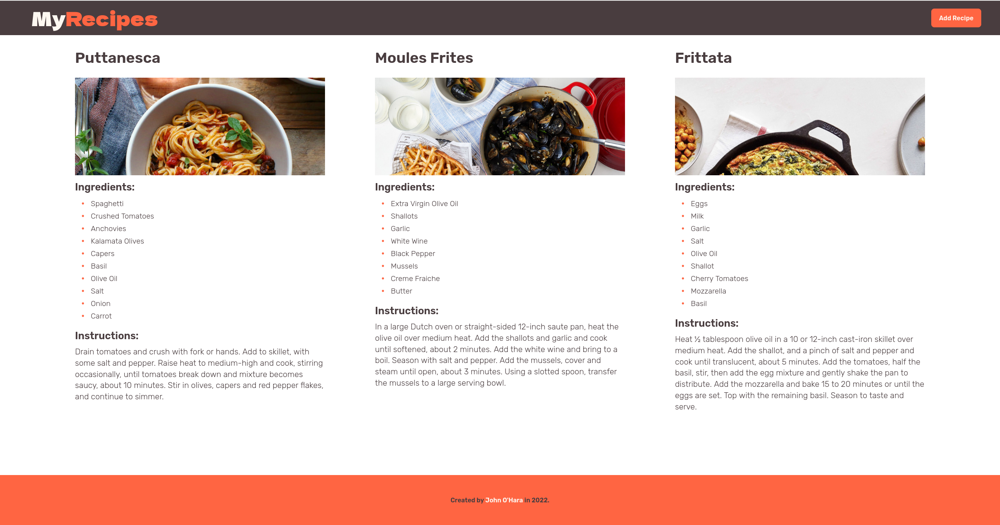
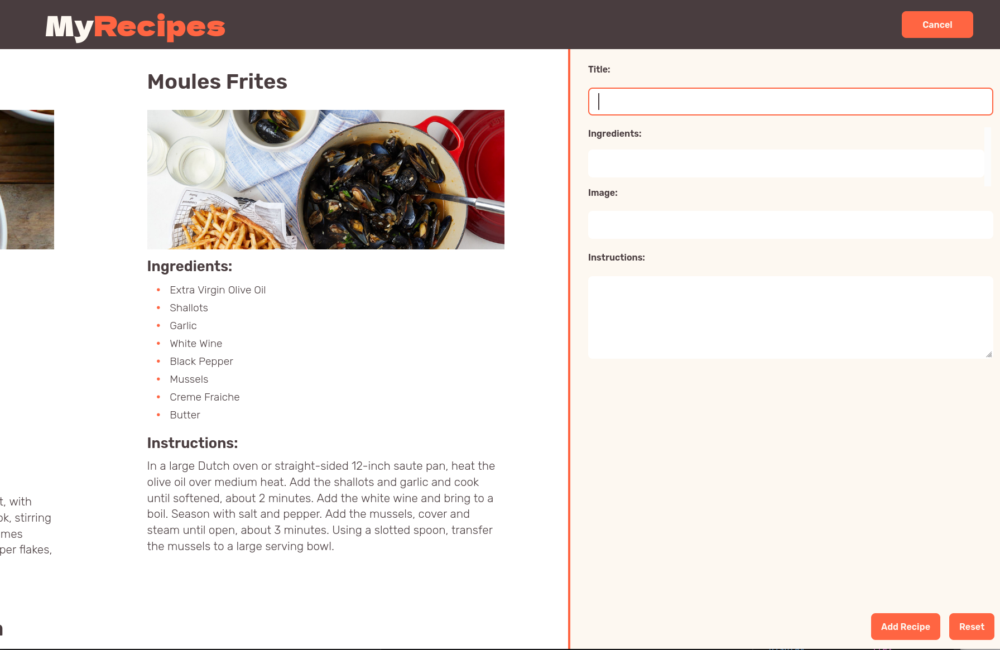

# MyRecipes React App

A frontend for a Recipe app, created using React.

## Screens

The main view, displaying a list of the recipes stored in MongoDB.

The expanded recipe form, which slides in from offscreen, displacing the main content as it appears.

